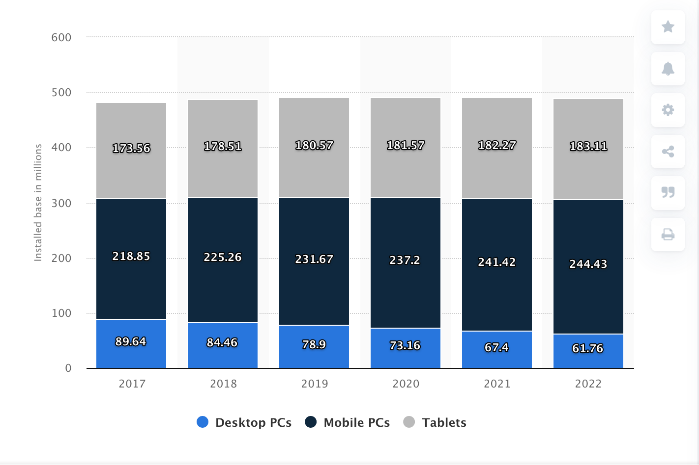

```{r, echo=FALSE, warning=FALSE, messages=FALSE}
knitr::opts_chunk$set(  echo=TRUE, eval=FALSE)
library(mgcv)
library(tidyverse)
library(brms);library(ggplot2);library(scales)
library(data.table)
library(directlabels)
```

# Estimating Desktop Browser Market Size

Desktop Firefox has been losing users for the past few years and we
have also been losing market share. We've generally attributed this to
a combination of Chrome taking our users and the generally declining
state of the desktop market.

We can use the combination of our user numbers (MAU), which we know,
and an external estimate of our market share to estimate the overall
size of the market.

```{r eval=TRUE, echo=FALSE}
ms.ww <- fread("browser-ww-monthly-200901-201910-first.csv")[,date:=as.Date(Date)]
ms.us <- fread("browser-us-monthly-200901-201910-first.csv")[,date:=as.Date(Date)]
mau <- fread("Desktop_MAU_in_US_and_ROW_2019_11_22-first.csv")[,date := as.Date(date)]
# Trim these to the same dates
ms.ww <- ms.ww[date >= min(mau$date)]
ms.us <- ms.us[date >= min(mau$date)]
mau <- mau[date <= max(ms.ww$date)]

df.ww <- data.table(date = ms.ww$date, usage = mau$mau_row + mau$mau_us, share = ms.ww$Firefox)
df.us <- data.table(date = ms.us$date, usage = mau$mau_us, share = ms.us$Firefox)
```

```{r eval=TRUE, echo=FALSE}
df <- df.ww

df$size <- df$usage/df$share
df$usage.normal <- df$usage/df$usage[1]
df$share.normal <- df$share/df$share[1]
df.long <- gather(df, key="Source", value="Frac", usage.normal, share.normal)
 ```

## Worldwide Market Size

Fhe following figure shows the decline of MAU and market share from
the period of 2016-04-01 to 2019-10-01. The MAU data comes from our
own telemetry and the market share data comes from StatCounter.
Each of these is normalized to the start of the period. 
Note that market share is declining faster than MAU.

```{r eval=TRUE,fig.width=6, fig.height=4, echo=FALSE}
ggplot(df.long) + geom_line(mapping=aes(x=date, y=Frac, color=Source))
```

We can get an estimate of the size of the market by dividing MAU
by our share of the market, giving us the graph below. Based on
this data, desktop market size has actually increased over
this period, from about 2 billion to about 3 billion. These numbers
do seem fairly high, but it's a straightforward calculation,
and we just need to assume that there's no systematic bias
in either of these measurements, then it would appear that
the market is growing.


```{r eval=TRUE,fig.width=6, fig.height=4, echo=FALSE}
ggplot(df) + geom_line(mapping=aes(x=date, y=size))
```

## US Market Size


Here is the same treatment for the US, which shows the market size
as approximately flat at ~400 million users.


```{r eval=TRUE, echo=FALSE}
df <- df.us

df$size <- df$usage/df$share
df$usage.normal <- df$usage/df$usage[1]
df$share.normal <- df$share/df$share[1]
df.long <- gather(df, key="Source", value="Frac", usage.normal, share.normal)
 ```


```{r eval=TRUE,fig.width=6, fig.height=4, echo=FALSE}
ggplot(df.long) + geom_line(mapping=aes(x=date, y=Frac, color=Source))
```

```{r eval=TRUE,fig.width=6, fig.height=4, echo=FALSE}
ggplot(df) + geom_line(mapping=aes(x=date, y=size))
```


# Sanity Check

There are a lot of potential sources of noise in this data. As a sanity
check, let's compare the US data to an independent source, which is the
installed base of desktop and laptops in the US from Statista. [https://www.statista.com/statistics/670172/united-states-installed-base-desktops-laptops-tablets/]. This shows the market as being nearly flat
at around 310 million for the past few years, projecting to be 305
million in 2022, so at least we are on the same order of
magnitude.

